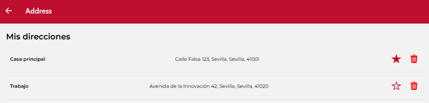

# Guía de Estudio para el Examen de Frontend

[Enlace a exámenes anteriores](https://github.com/orgs/IISSI2-IS-2025/repositories)

---

## Funciones reutilizables

### Fetch (Petición de detalles)
```javascript
    try {
      const fetchedXXX = await getDetail(route.params.id) // Id de lo que se busque, mirar función
      setXXX(fetchedXXX)
    } catch (error) {
      showMessage({
        message: `There was an error while retrieving XXXXX (id ${route.params.id}). ${error}`,
        type: "error",
        style: GlobalStyles.flashStyle,
        titleStyle: GlobalStyles.flashTextStyle
      })
    }
```

### Update (Actualizar entidad)
```javascript
    setBackendErrors([])
    try {
      const updatedProduct = await update(product.id, values)
      showMessage({
        message: `Product ${updatedProduct.name} succesfully updated`,
        type: "success",
        style: GlobalStyles.flashStyle,
        titleStyle: GlobalStyles.flashTextStyle
      })
      navigation.navigate("RestaurantDetailScreen", { id: product.restaurantId })
    } catch (error) {
      console.log(error)
      setBackendErrors(error.errors)
    }
```

### DeleteModal (Componente Modal)
```jsx
          <DeleteModal
            isVisible={schedulesToBeDeleted !== null}
            onCancel={() => setSchedulesToBeDeleted(null)}
            onConfirm={() => remove(schedulesToBeDeleted)}>
              <TextRegular>¿Estás seguro?</TextRegular>
          </DeleteModal>
```

### Remove (Eliminación con petición)
```javascript 
  setBackendErrors([])
    try {
      await remove(id_de_la_cosa)
      await fetchDetalles()
      setCosaToBeDeleted(null)
      showMessage({
        message: `Cosa succesfully removed`,
        type: "success",
        style: GlobalStyles.flashStyle,
        titleStyle: GlobalStyles.flashTextStyle
      })
    } catch (error) {
      console.log(error)
      setCosaToBeDeleted(null)
      showMessage({
        message: `Cosa could not be removed.`,
        type: "error",
        style: GlobalStyles.flashStyle,
        titleStyle: GlobalStyles.flashTextStyle
      })
    }
```

### Esquema Base Formik
```jsx
<Formik
      validationSchema={validationSchema} 
      initialValues={initialScheduleValues}
      onSubmit={update_o_accion}>
      {({ handleSubmit, setFieldValue, values }) => (
        <ScrollView>
          <View style={{ alignItems: "center" }}>
            <View style={{ width: "60%" }}>
              <InputItem
                name="startTime"
                label="Start Time (HH:mm:ss):"
              />
              <InputItem
                name="endTime" // Nombre en el modelo
                label="End Time (HH:mm:ss):" // Como se muestra
              />

              {backendErrors &&
                backendErrors.map((error, index) => <TextError key={index}>{error.param}-{error.msg}</TextError>)
              }

              <Pressable
                onPress={ handleSubmit }
                style={({ pressed }) => [
                  {
                    backgroundColor: pressed
                      ? GlobalStyles.brandSuccessTap
                      : GlobalStyles.brandSuccess
                  },
                  styles.button
                ]}>
                <View style={[{ flex: 1, flexDirection: "row", justifyContent: "center" }]}>
                  <MaterialCommunityIcons name="content-save" color={"white"} size={20}/>
                  <TextRegular textStyle={styles.text}>
                    Save
                  </TextRegular>
                </View>
              </Pressable>
            </View>
          </View>
        </ScrollView>
      )}
    </Formik>
```

---

## Estilos reutilizables



### Estructura de componente y acciones
```jsx
 <View style={styles.addressContainer}>
      <TextSemiBold>{item.alias}</TextSemiBold>
      <TextRegular>{item.street}, {item.city}, {item.province}, {item.zipCode}</TextRegular>
      <View style={styles.actions}>
        <Pressable
          onPress={() => setAddressAsDefault(item)}
          style={({ pressed }) => [{
            padding: 5,
            borderRadius: 4,
            backgroundColor: pressed ? brandPrimaryTap : "transparent"
          }]}
        >
          <Ionicons name={item.isDefault ? "star" : "star-outline"} size={24} color={brandPrimary} />
        </Pressable>
        <Pressable
          onPress={() => setAddressToBeDeleted(item)}
          style={({ pressed }) => [{
            padding: 5,
            borderRadius: 4,
            backgroundColor: pressed ? "rgba(255,0,0,0.2)" : "transparent"
          }]}
        >
          <Ionicons name="trash" size={24} color="red" />
        </Pressable>
      </View>
    </View>
```

### Clase StyleSheet
```javascript
 addressContainer: {
    paddingVertical: 15,
    paddingHorizontal: 10,
    borderBottomWidth: 1,
    borderColor: "#ddd",
    flexDirection: "row",
    justifyContent: "space-between",
    alignItems: "center"
  }
```

### Centrado Horizontal Completo
Para alinear elementos en la misma fila y centrarlos:
```jsx
<View style={{ flexDirection: "row", justifyContent: "space-between", alignItems: "center" }}>
```
> **Nota de Layout:** `alignItems` gestiona el espacio perpendicular a `flexDirection`, mientras que `justifyContent` gestiona el espacio paralelo.

---

## Propagación y Manejo de Arrays

### Mapeo de Datos Base
Ejemplo de cómo añadir un valor por defecto al principio de un array de datos recuperados:
```javascript
      const fetchedScheduleReshaped = [{
        label: "Not scheduled",
        value: "none"
      },
      ...fetchedSchedule.map((e) => {
        return {
          label: `${e.startTime} - ${e.endTime}`,
          value: e.id
        }
      })
      ]
```
